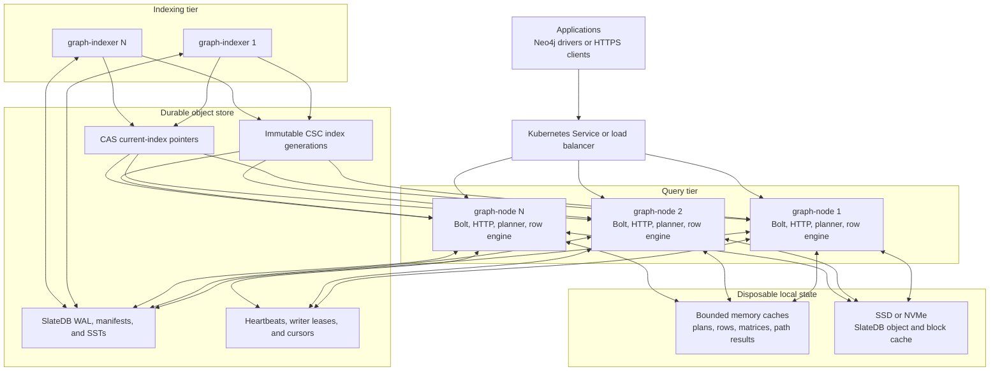
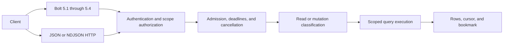
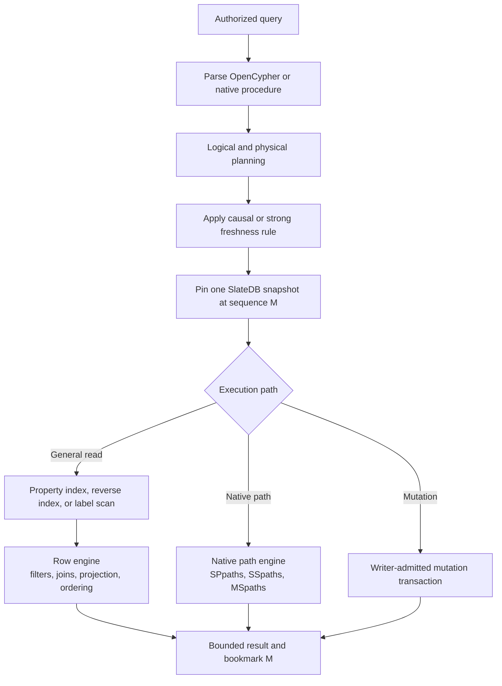
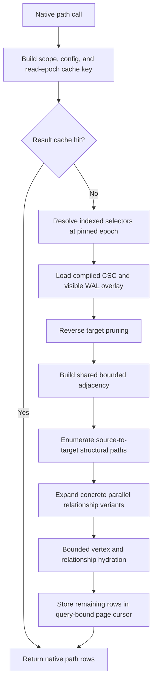
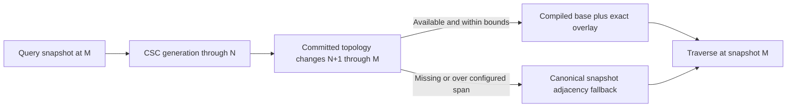
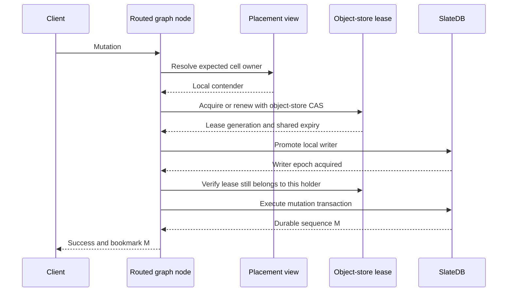
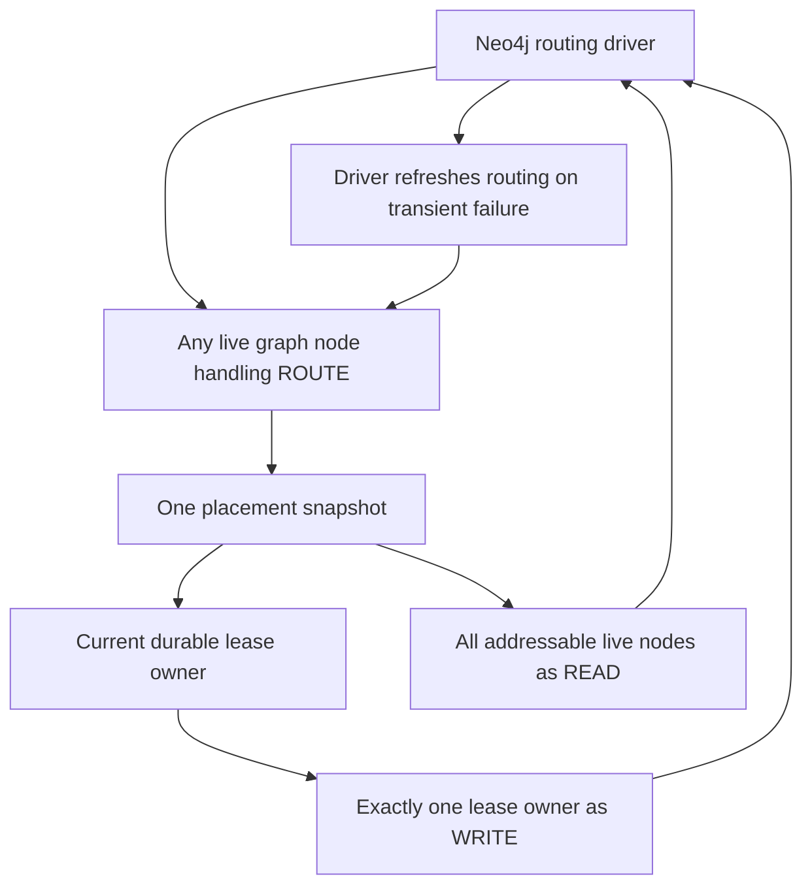
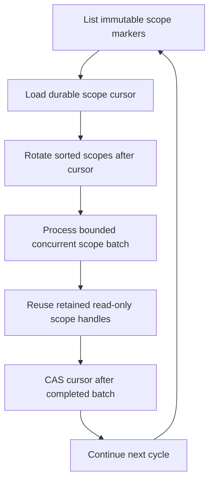
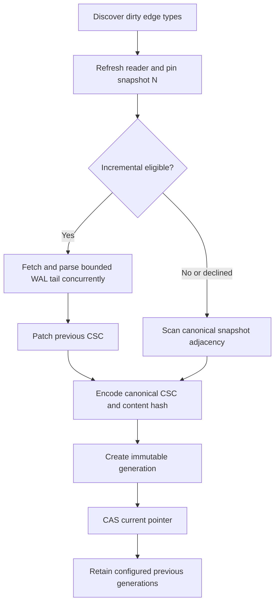
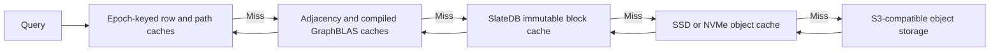

# HydraDB Architecture

HydraDB is a distributed graph database built in Rust on top of SlateDB and
S3-compatible object storage. Object storage contains the durable graph,
coordination records, and immutable traversal indexes. Query nodes and indexer
workers hold disposable memory and SSD/NVMe caches.

This document describes the architecture implemented in the current codebase.
It focuses on request execution, snapshot consistency, writer ownership,
indexing, caching, and failure handling.

## Core Invariants

- A graph scope is a namespace path plus a graph ID. Each scope contains one or
  more independently stored cells.
- Every `(scope, cell)` has at most one admitted writer and any number of
  readers.
- A durable object-store lease admits the current writer. SlateDB's writer
  epoch and WAL barrier are the final split-writer fence.
- Every query evaluates canonical records against one pinned SlateDB snapshot.
- An index generation is an accelerator, never the source of graph truth.
- A query combines an immutable index base with the visible WAL tail or falls
  back to canonical snapshot reads.
- Memory, local writer handles, compiled matrices, and SSD cache contents are
  disposable. Losing them can increase latency but cannot lose committed data.
- Query nodes coordinate through object storage. No writable controller or
  separate consensus database sits in the graph data path.

## Runtime Topology



`graph-node` serves public queries and mutations. `graph-indexer` has no public
query listener and never opens graph writers. It builds reconstructible sparse
topology indexes from canonical SlateDB data.

The processes are stateless with respect to durable graph data. Kubernetes may
deploy graph nodes as a StatefulSet to provide stable advertised Bolt
addresses, but the Pod filesystem and Pod identity are not storage authority.

## Graph Scope And Storage Model

A `GraphScope` combines:

1. A root tenant namespace and up to seven nested subnamespaces.
2. A graph ID inside that namespace path.
3. A cell ID selected by the request target.

The physical graph path is deterministic:

```text
<base>/namespaces/<tenant>/subnamespaces/<child>/.../graphs/<graph-id>/
```

Each cell is opened as an independent SlateDB database beneath that graph
scope. Canonical records inside its WAL and SSTs include:

- vertices, labels, and vertex properties;
- relationship identity, endpoints, type, direction, and properties;
- outbound and inbound topology records;
- high-degree adjacency segments and tombstones;
- vertex and relationship property indexes;
- degree and count records;
- idempotency and import-fingerprint records;
- dirty topology markers and lifecycle state.

Graph records are SlateDB keys, not one object-store object per vertex or edge.
SlateDB controls WAL durability, manifests, compaction, snapshots, and its
writer epoch.

### Coordination And Index Objects

HydraDB stores small coordination and index objects beside the database:

```text
<base>/
+-- _graph_nodes/v1/<node-id>
+-- _graph_scopes/v1/<graph-id>/<root-namespace>/.../__scope__
+-- _graph_indexer/v1/<root-scope>/scope-cursor
+-- _coordination/v1/server-clock
+-- namespaces/<tenant>/.../graphs/<graph-id>/
    +-- _writer_leases/v2/<cell-id>
    +-- _cell_writers/v1/...
    +-- <cell-id>/
        +-- SlateDB WAL, manifests, and SSTs
        +-- _graph_index/<cell-id>/<edge-type>/
            +-- current
            +-- generations/<sequence>-<generation>.csc
```

The `_cell_writers/v1` records are advisory observability records. They are
published only after successful writer promotion and are not ownership
authority. The durable writer lease and SlateDB fencing decide whether a node
may commit.

Immutable `__scope__` markers let indexers discover graph scopes without a
writable catalog service.

## Client Boundary

HydraDB exposes Bolt and HTTP through one `ClientQueryService`.



Before execution, the service:

1. Authenticates the session or request.
2. Resolves the database token into a namespace, graph, and cell target.
3. Authorizes that exact scope.
4. Classifies the statement before applying read or write permissions.
5. Enforces query size, runtime, page, result-memory, global concurrency, and
   namespace concurrency limits.
6. Applies cancellation and the selected consistency mode.
7. Returns bounded pages and a durable sequence bookmark.

Bolt supports Neo4j-driver auto-commit query flow and routing. Write-capable
clustered clients use a routing URI such as `neo4j://`, `neo4j+s://`, or
`neo4j+ssc://`. Direct `bolt://` node connections bypass routing and are meant
for diagnostics or targeted failure tests.

Explicit transactions spanning multiple `RUN` requests are not exposed. Each
accepted mutation is executed and committed as one bounded server operation.

## Query Execution

### Common Pipeline



Every read uses one `DbSnapshot` or `DbReaderSnapshot`. Property indexes,
reverse adjacency, topology, metadata, and tombstones are read at the same
storage sequence. A planner optimization cannot replace that snapshot with a
newer view.

The general OpenCypher planner can select vertex-property and
relationship-property indexes, ordered limit pushdown, reverse expansion,
join/connectivity ordering, expand-into, GraphBLAS-compatible topology work,
or a bounded full-scan fallback. Plan and access-path choices are emitted in
query telemetry.

GraphBLAS accelerates compatible sparse topology operations. It does not
replace the row engine: metadata predicates, relationship identity, joins,
ordering, projections, aggregation, and hydration still use canonical
snapshot records.

### Native Path Procedures

HydraDB implements three snapshot-scoped path procedures:

| Procedure | Purpose |
| --- | --- |
| `algo.SPpaths` | Bounded paths between one source and one target |
| `algo.SSpaths` | Bounded paths from one source |
| `algo.MSpaths` | Indexed resolution and batched evaluation of many source and target values |



For unweighted multi-target work, `MSpaths` shares selector hydration,
topology, reverse target pruning, and adjacency across source-target pairs. It
uses grouped multi-target breadth-first enumeration instead of rebuilding the
same neighborhood for every pair. Weighted or cost-ranked paths retain their
scoring semantics while reusing request-local topology and metadata caches.

Parallel relationships remain distinct path evidence. Fair relationship
variant mode distributes a bounded result budget across structural paths so
one highly connected pair cannot consume the entire response.

The native path result cache is keyed by the pinned read epoch. A mutation that
advances storage produces a different cache key. Pagination stores unconsumed
rows in bounded, expiring server state, so fetching page two does not rerun the
procedure against a newer snapshot.

## Read Consistency

HydraDB supports causal and strong reads.

### Causal

Causal is the default hot path. It uses the node's current durable reader view.
If the caller supplies a bookmark, the reader refreshes until the bookmark's
storage sequence is visible before pinning the query snapshot.

### Strong

Strong mode refreshes the SlateDB reader from object storage before pinning the
snapshot. It observes durable writes visible at the completion of that refresh
and intentionally pays the remote freshness cost.

Both modes are strongly internally consistent once the snapshot is pinned. A
query never mixes metadata from one storage sequence with topology from
another.

### Indexed Base Plus WAL Overlay

An immutable CSC generation records a base storage sequence `N`. A query pins
its snapshot at sequence `M`.



The overlay resolves affected edge state against the same pinned snapshot, so
recent committed writes are visible before a new index generation is
published. WAL-tail file and edge work are bounded. If the tail is unavailable
or exceeds configured limits, the engine uses canonical snapshot adjacency
instead of returning stale topology.

## Writer Ownership And Mutations

Writer admission has three layers with different responsibilities.

1. **Placement** chooses the expected contender and provides routing locality.
2. **Durable lease** admits one node and process to open the writer.
3. **SlateDB fencing** prevents a stale writer from committing.

### Liveness And Placement

Each ready graph node publishes:

```text
<base>/_graph_nodes/v1/<node-id>
```

The live set is configured membership intersected with fresh heartbeat
objects. Heartbeat age uses object-store `LastModified`, not a node's local
clock. Rendezvous hashing over that shared live set selects a stable contender
for each `(scope, cell)`.

When heartbeat listing fails, the placement view moves from fresh, to a bounded
cached grace view, to shed. A shed node withdraws readiness, advertises no Bolt
routing table, and refuses new writer promotion. It does not guess from stale
membership.

Placement is a gate for new contenders, not the durable ownership record. An
existing valid lease holder may continue through temporary heartbeat-view
divergence rather than dropping a healthy writer because of a LIST blip.

### Durable Writer Lease



The lease record contains the node, process holder, generation, duration, and
release state. Acquisition and renewal use object-store conditional updates.
Expiry is based on the lease object's object-store timestamp. HydraDB probes
`_coordination/v1/server-clock` to compare lease age using shared server time,
then tracks the remaining interval monotonically inside the process. A newly
started observer does not grant an old lease a fresh local TTL.

The lease is renewed periodically while a writer is held. Loss of ownership
retires the local writer. A background ownership reconciler also closes cached
scope writers after placement or lease ownership moves elsewhere.

Within one process, routed runtimes opening the same physical store, path, and
node share writer state and promotion gates. Final-owner cleanup closes the
writer and retires its registration. Standalone shard opens remain independent
for tests and embedded use.

### Mutation Commit

After admission, a mutation updates graph records in one SlateDB transaction.
Depending on the operation this includes topology, reverse topology, metadata,
property indexes, counts, tombstones, idempotency state, and dirty markers.
The client receives success only after the WAL commit reaches the configured
durability point.

Durable mutation identities are caller-scoped idempotency keys or generated
ULIDs, not process-local Bolt session counters. Reusing one key with different
content returns an explicit non-retryable idempotency conflict.

Bulk guarded merges can require an incoming metadata version to be strictly
newer and can preserve create-only properties. This prevents delayed replay
from moving timestamped metadata backward.

## Bolt Routing And Failover



A routing response is built from one placement snapshot. All addressable live
nodes are readers. The current live durable lease owner is the writer; only
when no live lease exists does routing use rendezvous placement to identify the
contender that may acquire it.

If a request reaches a non-owner, HydraDB returns a routing-class error such
as `NotCellWriter` rather than calling it writer fencing. A routed Bolt driver
refreshes the table and retries at the advertised writer. Direct node clients
must handle this themselves.

Expected routing turnover is distinct from a SlateDB `Fenced` close. The latter
means a writer epoch lost authority and is classified as fencing telemetry.

## Indexer Architecture

The indexer turns canonical adjacency into immutable CSC generations without
joining the write path.

### Fair Scope Scheduling



Scopes are sorted, rotated after the durable cursor, and processed in bounded
concurrent batches. The cursor prevents every restart from beginning at the
same first tenant. CAS advancement prevents a stale indexer from overwriting a
newer cursor written by another process.

A bounded retained-reader cache keeps recently used scope readers open. This
avoids replaying the same SlateDB WAL whenever the scheduler revisits a scope.
Eviction closes idle readers; it never affects durable graph state.

### Generation Build And Publication



Incremental construction is used only when a previous generation exists, the
graph meets the configured edge threshold, and the WAL-tail span is within its
file cap. Immutable WAL files are fetched with bounded concurrency and parsed
once into a shared per-shard cache so multiple edge types can reuse the work.
Affected edge state is resolved concurrently.

If incremental construction is unsafe or too expensive, it declines and the
indexer performs a full snapshot build. The fallback is normal control flow,
not an indexing failure.

The generated CSC is immutable and content-addressed. Publication creates the
generation object first and then conditionally advances the small `current`
pointer. Multiple indexers may duplicate computation, but CAS prevents an
older generation from replacing a newer one. Indexer downtime increases query
overlay or fallback work; it does not block reads or writes.

## Cache Hierarchy



| Cache | Typical contents | Correctness boundary |
| --- | --- | --- |
| Parsed-query cache | Parsed and lowered OpenCypher forms | Query text and parser configuration |
| Relationship caches | Direct rows, source destinations, property-index rows, and hop-aware reachable sets | Scope, cell, edge type, direction, filters, hop range, and read epoch |
| Native path result cache | Completed native procedure rows | Scope, procedure config, read epoch, and result budget |
| Native path page cursor | Unconsumed rows from one completed procedure | Opaque query-bound cursor with bounded lifetime |
| Matrix caches | Hydrated adjacency and compiled GraphBLAS matrices | Cell, edge type, and index generation |
| WAL-tail file cache | Parsed immutable WAL topology entries | Immutable WAL object identity |
| SlateDB block/object cache | Immutable SST and object blocks | SlateDB object identity and snapshot visibility |
| Retained indexer readers | Open read-only scope handles | Bounded scheduler cache, refreshed before build |

All caches have entry, byte, lifetime, or concurrency bounds appropriate to
their contents. Cache hits can remove remote reads and compilation work, but a
cache cannot make data visible outside the query's pinned snapshot.

## Failure Semantics

| Event | Behavior |
| --- | --- |
| Query node restart | Durable state remains in object storage; local caches warm again |
| Indexer outage | Reads use the last generation plus WAL overlay or canonical fallback |
| Placement LIST failure | Use bounded grace view, then shed readiness and refuse promotion |
| Writer node crash | Lease expires by object-store time; a new contender CAS-acquires and promotes |
| Lease renewal loss | Local writer is retired and later writes are routed elsewhere |
| SlateDB writer fenced | Stale writer cannot commit and is closed; reads may continue through a reader |
| Index publication race | Immutable objects may duplicate; CAS keeps `current` monotonic |
| Missing or oversized WAL tail | Decline incremental work and use a full or canonical snapshot path |
| Memory or SSD loss | Cold latency rises; committed graph data is unaffected |
| Result or work budget exceeded | Query fails explicitly instead of returning partial unmarked data |

## Observability

Both runtimes emit OpenTelemetry traces, structured logs, and Prometheus
metrics. Important dimensions include:

- namespace, graph scope, cell, and node;
- read consistency and pinned storage sequence;
- planner access path, optimizer passes, and planning duration;
- query runtime, result rows, cache outcome, and scan budgets;
- placement state, lease generation, writer promotion, renewal, and retirement;
- index mode, base sequence, WAL-tail span, generation publication, and cursor
  progress;
- stable failure classes such as admission, authorization, routing, fencing,
  timeout, storage, query, and corruption.

The graph-node admin listener exposes readiness and metrics independently of
the public Bolt and HTTP listeners. The indexer exposes its own readiness and
metrics endpoint and does not serve client graph traffic.

## Authority Boundaries

| Concern | Authority |
| --- | --- |
| Durable graph records | SlateDB WAL and SST data in object storage |
| Query-visible state | One query-scoped SlateDB snapshot |
| Causal position | Durable SlateDB sequence bookmark |
| New writer contender | Rendezvous placement over the shared live-node view |
| Writer admission | Object-store CAS lease for `(scope, cell)` |
| Final split-writer protection | SlateDB writer epoch and WAL barrier |
| Live routing membership | Fresh object-store heartbeat records |
| Bolt WRITE endpoint | Current lease owner, with placement fallback only when unleased |
| Current traversal generation | Object-store CAS `current` pointer |
| Canonical graph correctness | Snapshot-scoped SlateDB records and tombstones |
| Memory and SSD state | Disposable performance cache |

In compact form:

```text
bounded query compute
        +
asynchronous index compute
        +
disposable memory and SSD caches
        +
object-store writer leases and routing heartbeats
        +
SlateDB single-writer, multi-reader durability
        +
S3-compatible object storage as shared ground truth
```

## Code Map

| Area | Primary code |
| --- | --- |
| Public query service | `src/client/service.rs` |
| Bolt protocol and routing | `src/client/bolt.rs`, `src/client/bolt/routing.rs` |
| HTTP protocol | `src/client/http.rs` |
| Namespace and graph scope | `src/core/namespace.rs` |
| Routed scope lifecycle | `src/engine/cluster.rs`, `src/shard/lifecycle.rs` |
| Writer leases | `src/engine/writer_lease.rs` |
| Placement heartbeats | `crates/placement/src/heartbeat.rs` |
| OpenCypher planning | `src/query/opencypher.rs`, `src/shard/query_optimizer.rs` |
| General query execution | `src/shard/query.rs` |
| Native path procedures | `src/query/path_procedure.rs`, `src/shard/path_procedure.rs` |
| GraphBLAS compilation | `src/sparse_kernel/graphblas.rs` |
| Canonical mutations | `src/shard/write.rs` |
| Index storage and builds | `src/engine/index_store.rs`, `src/engine/artifact_build.rs` |
| Indexer runtime | `src/bin/graph-indexer.rs` |
| Query-node runtime | `src/bin/graph-node.rs` |
